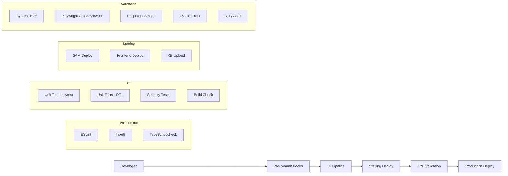
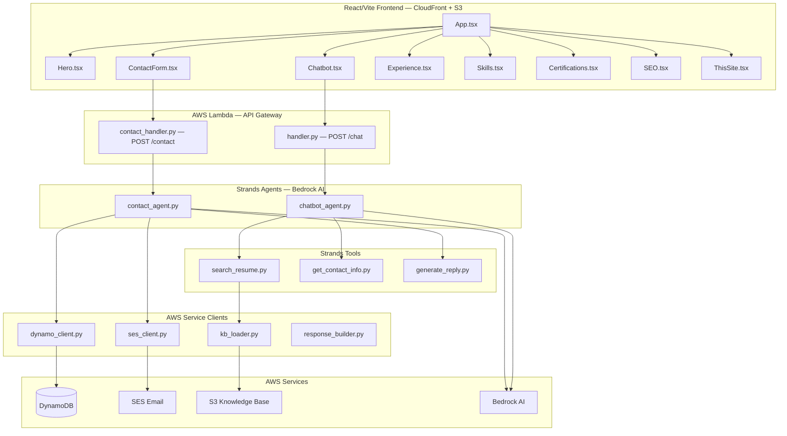

# Codebase Structure, Testing Strategy & Coverage Report

**Project:** camiloavila.dev — AI Resume Portfolio  
**Generated:** 2026-05-08  
**Last Coverage Data:** 2026-04-02 (main branch)

---

## 1. Codebase Tree — Deep Structure

```
camiloavila.dev/
│
├── .github/
│   ├── dependabot.yml                          # Automated dependency updates
│   └── workflows/
│       ├── deploy-develop.yml                  # CI/CD: Staging deploy (develop branch)
│       ├── deploy.yml                          # CI/CD: Production deploy (main branch)
│       ├── pr-checks.yml                       # CI/CD: PR quality gates
│       ├── pr-coverage-report.yml              # CI/CD: Coverage reporting on PRs
│       ├── security-tests.yml                  # CI/CD: Weekly security scans
│       ├── update-coverage-history.yml         # CI/CD: Coverage history tracking
│       └── visual-regression.yml               # CI/CD: Visual diff testing
│
├── backend/
│   ├── requirements.txt                        # Python dependencies (Lambda layer)
│   ├── .lambda_layer/                          # Lambda layer build output
│   ├── src/
│   │   ├── handler.py                          # Lambda: POST /chat (Chatbot entrypoint)
│   │   ├── contact_handler.py                  # Lambda: POST /contact (Contact form entrypoint)
│   │   ├── requirements.txt                    # Lambda function dependencies
│   │   ├── agents/
│   │   │   ├── __init__.py                     # Agent module init
│   │   │   ├── chatbot_agent.py                # Strands Agent: Resume Q&A (Bedrock)
│   │   │   └── contact_agent.py                # Strands Agent: Contact email generation
│   │   ├── tools/
│   │   │   ├── __init__.py                     # Tools module init
│   │   │   ├── generate_reply.py               # Strands Tool: AI email paragraph (Bedrock)
│   │   │   ├── get_contact_info.py             # Strands Tool: Returns contact details
│   │   │   └── search_resume.py                # Strands Tool: Loads knowledge base (S3)
│   │   └── utils/
│   │       ├── __init__.py                     # Utils module init
│   │       ├── dynamo_client.py                # DynamoDB: Save/retrieve contact records
│   │       ├── kb_loader.py                    # S3: Knowledge base loader with cache
│   │       ├── response_builder.py             # HTTP: Response builder with security headers
│   │       └── ses_client.py                   # SES: Email sender with template
│   └── tests/
│       ├── conftest.py                         # Shared pytest fixtures (all tests)
│       └── unit/
│           ├── conftest.py                     # Unit test fixtures
│           ├── test_handler.py                 # Tests: Chatbot Lambda handler
│           ├── test_contact_handler.py         # Tests: Contact Lambda handler
│           ├── test_tools.py                   # Tests: All Strands tools (3 tools)
│           ├── test_dynamo_client.py           # Tests: DynamoDB operations (moto)
│           ├── test_kb_loader.py               # Tests: S3 knowledge base loader
│           ├── test_ses_client.py              # Tests: SES email sending (moto)
│           ├── test_security.py                # Tests: Security guardrails (OWASP LLM)
│           └── test_security_headers.py        # Tests: HTTP security headers
│
├── frontend/
│   ├── .env.example                            # Environment variable template
│   ├── .prettierrc                             # Code formatting config
│   ├── eslint.config.js                        # ESLint configuration
│   ├── index.html                              # HTML entry point
│   ├── package.json                            # Node.js dependencies
│   ├── package-lock.json                       # Dependency lock file
│   ├── tsconfig.json                           # TypeScript configuration
│   ├── tsconfig.node.json                      # TypeScript node config
│   ├── vite.config.ts                          # Vite build configuration
│   └── src/
│       ├── App.css                             # Global styles
│       ├── App.tsx                             # Root component (layout composition)
│       ├── main.tsx                            # Application entry point (React 18)
│       ├── vite-env.d.ts                       # Vite type declarations
│       └── components/
│           ├── Certifications.tsx              # Section: AWS certifications display
│           ├── Chatbot.tsx                     # Component: AI chat widget (inline)
│           ├── ContactForm.tsx                 # Component: Contact form with validation
│           ├── Experience.tsx                  # Section: Work history timeline (tabs)
│           ├── Hero.tsx                        # Section: Portfolio hero/intro
│           ├── SEO.tsx                         # Component: Meta tags + structured data
│           ├── Skills.tsx                      # Section: Technical skills grid
│           └── ThisSite.tsx                    # Section: Technical stack description
│
├── infrastructure/
│   ├── app.py                                  # AWS CDK application entry
│   ├── cdk.json                                # CDK context configuration
│   ├── stack.py                                # CDK stack definition (alternative to SAM)
│   ├── requirements.txt                        # CDK Python dependencies
│   ├── README.md                               # Infrastructure documentation
│   ├── sam/
│   │   ├── locals.json                         # SAM local testing config
│   │   └── sam.log                             # SAM deployment logs
│   └── cdk.out/                                # CDK synthesized CloudFormation
│       ├── camiloavila-portfolio.template.json
│       ├── camiloavila-portfolio.metadata.json
│       ├── camiloavila-portfolio.assets.json
│       ├── manifest.json
│       └── tree.json
│
├── layers/
│   └── strands/
│       └── python.zip                          # Lambda layer: Strands Agents SDK
│       └── python/lib/python3.13/site-packages/
│           ├── boto3/                          # AWS SDK for Python (vendored)
│           ├── guardrails_hub_types/           # Guardrails AI type definitions
│           └── strands/                        # Strands Agents SDK (vendored)
│
├── tests/
│   ├── package.json                            # E2E test dependencies
│   ├── package-lock.json                       # E2E dependency lock
│   └── e2e/
│       ├── cypress/
│       │   ├── cypress.config.ts               # Cypress test runner config
│       │   ├── tsconfig.json                   # TypeScript config for Cypress
│       │   └── specs/
│       │       ├── chatbot.cy.ts               # E2E: Chatbot widget tests
│       │       └── contact_form.cy.ts          # E2E: Contact form tests
│       ├── playwright/
│       │   ├── conftest.py                     # Pytest fixtures for Playwright
│       │   ├── pytest.ini                      # Pytest configuration
│       │   └── specs/
│       │       ├── test_accessibility.py       # A11y: WCAG compliance tests
│       │       ├── test_api.py                 # API: Backend endpoint tests
│       │       ├── test_functional.py          # Functional: User journey tests
│       │       ├── test_security.py            # Security: Headers, CSP, CORS tests
│       │       └── test_smoke.py               # Smoke: Basic functionality tests
│       └── puppeteer/
│           ├── jest.config.ts                  # Jest config for Puppeteer
│           ├── tsconfig.json                   # TypeScript config
│           └── specs/
│               ├── chatbot.test.ts             # E2E: Chatbot Puppeteer tests
│               └── contact_form.test.ts        # E2E: Contact form Puppeteer tests
│
├── tests/performance/
│   ├── k6-config.js                            # k6: General load test config
│   ├── k6-chat-api.js                          # k6: Chat API load tests
│   ├── k6-contact-api.js                       # k6: Contact API load tests
│   └── README.md                               # Performance testing docs
│
├── docs/
│   ├── architecture.md                         # System architecture documentation
│   ├── coverage-dashboard/index.html           # Coverage report dashboard
│   └── reports-dashboard/index.html            # Test reports dashboard
│
├── plans/
│   ├── security-audit-report.md                # Security audit findings
│   └── security-fixes-implementation.md        # Security remediation plan
│
├── scripts/
│   ├── compare.js                              # Utility: Compare test results
│   ├── create_guardrail.py                     # Utility: Create Bedrock guardrail
│   ├── generate-html.js                        # Utility: Generate report HTML
│   └── screenshot.js                           # Utility: Take screenshots for testing
│
├── template.yaml                               # AWS SAM: Infrastructure as Code (primary)
├── packaged.yaml                               # SAM: Packaged template (deploy output)
├── samconfig.toml                              # SAM: Deploy configuration (staging/prod)
├── env.json                                    # Local environment variables for SAM
├── dns-change.json                             # Route 53 DNS change template
├── .gitignore                                  # Git ignore patterns
├── .coverage-history.json                      # Coverage history tracking
├── CHANGELOG.md                                # Project changelog
├── CONTRIBUTING.md                             # Contribution guidelines
└── README.md                                   # Project documentation
```

**Total source files:** 47  
**Total test files:** 17  
**Total configuration files:** 25

---

## 2. File Categorization

### 2.1 Category Breakdown

| Category | Count | Files |
|----------|-------|-------|
| **Backend — Handlers** | 2 | `handler.py`, `contact_handler.py` |
| **Backend — Agents** | 2 | `chatbot_agent.py`, `contact_agent.py` |
| **Backend — Tools** | 3 | `generate_reply.py`, `get_contact_info.py`, `search_resume.py` |
| **Backend — Utils** | 4 | `dynamo_client.py`, `kb_loader.py`, `response_builder.py`, `ses_client.py` |
| **Frontend — Components** | 8 | `App.tsx`, `Chatbot.tsx`, `ContactForm.tsx`, `Experience.tsx`, `Hero.tsx`, `Certifications.tsx`, `Skills.tsx`, `SEO.tsx`, `ThisSite.tsx` |
| **Frontend — Config** | 5 | `vite.config.ts`, `tsconfig.json`, `eslint.config.js`, `package.json`, `.prettierrc` |
| **Infrastructure — SAM** | 2 | `template.yaml`, `samconfig.toml` |
| **Infrastructure — CDK** | 3 | `app.py`, `stack.py`, `cdk.json` |
| **Infrastructure — CI/CD** | 7 | GitHub Actions workflows |
| **Tests — Unit** | 8 | `test_handler.py`, `test_contact_handler.py`, `test_tools.py`, `test_dynamo_client.py`, `test_kb_loader.py`, `test_ses_client.py`, `test_security.py`, `test_security_headers.py` |
| **Tests — E2E (Cypress)** | 2 | `chatbot.cy.ts`, `contact_form.cy.ts` |
| **Tests — E2E (Playwright)** | 5 | `test_accessibility.py`, `test_api.py`, `test_functional.py`, `test_security.py`, `test_smoke.py` |
| **Tests — E2E (Puppeteer)** | 2 | `chatbot.test.ts`, `contact_form.test.ts` |
| **Tests — Performance** | 3 | `k6-chat-api.js`, `k6-contact-api.js`, `k6-config.js` |
| **Documentation** | 5 | `README.md`, `CHANGELOG.md`, `CONTRIBUTING.md`, `architecture.md`, security plans |
| **Scripts/Utilities** | 4 | `compare.js`, `create_guardrail.py`, `generate-html.js`, `screenshot.js` |
| **Lambda Layers** | 1 | `strands/python.zip` (vendored dependencies) |

### 2.2 Layer Classification

| Layer | Technology | Purpose |
|-------|-----------|---------|
| **Frontend** | React 18 + TypeScript + Vite | Portfolio UI, chat widget, contact form |
| **Backend** | Python 3.13 + AWS Lambda | API handlers, AI agents, AWS service clients |
| **AI/ML** | Amazon Bedrock + Strands Agents | RAG chatbot, AI email generation |
| **Infrastructure** | AWS SAM (primary) + CDK (alternative) | IaC for all AWS resources |
| **Database** | DynamoDB | Contact form submission storage |
| **Email** | Amazon SES | Automated reply emails |
| **Storage** | Amazon S3 | Knowledge base + frontend hosting |
| **CDN** | CloudFront + WAF | Content delivery + web application firewall |

---

## 3. Testing Strategy Analysis

### 3.1 Recommended Testing Strategy by Category

```mermaid
flowchart TD
    A[Testing Pyramid] --> B[Unit Tests]
    A --> C[Integration Tests]
    A --> D[E2E Tests]
    A --> E[Performance Tests]
    A --> F[Security Tests]
    A --> G[Accessibility Tests]

    B --> B1[Backend handlers]
    B --> B2[Backend utils]
    B --> B3[Backend tools]
    B --> B4[Backend agents]

    C --> C1[DynamoDB operations]
    C --> C2[SES email sending]
    C --> C3[S3 knowledge loader]
    C --> C4[API Gateway integration]

    D --> D1[Cypress - browser E2E]
    D --> D2[Playwright - cross-browser]
    D --> D3[Puppeteer - headless Chrome]

    E --> E1[k6 - API load testing]

    F --> F1[OWASP LLM guardrails]
    F --> F2[HTTP security headers]
    F --> F3[Input validation]
    F --> F4[Output sanitization]

    G --> G1[WCAG 2.1 AA compliance]
    G --> G2[ARIA attributes]
    G --> G3[Keyboard navigation]
```



### 3.2 Testing Strategy Matrix

| Component | Unit | Integration | E2E | Security | Performance | Accessibility |
|-----------|------|-------------|-----|----------|-------------|---------------|
| `handler.py` | ✅ pytest | ✅ API Gateway | ✅ Cypress | ✅ Guardrails | ✅ k6 | — |
| `contact_handler.py` | ✅ pytest | ✅ API Gateway | ✅ Cypress | ✅ Guardrails | ✅ k6 | ✅ Playwright |
| `chatbot_agent.py` | ✅ pytest | ✅ Bedrock mock | ✅ Cypress | ✅ Prompt injection | — | — |
| `contact_agent.py` | ✅ pytest | ✅ Bedrock mock | ✅ Cypress | ✅ Output validation | — | — |
| `search_resume.py` | ✅ pytest | ✅ S3 mock | — | — | — | — |
| `get_contact_info.py` | ✅ pytest | — | — | — | — | — |
| `generate_reply.py` | ✅ pytest | ✅ Bedrock mock | — | — | — | — |
| `dynamo_client.py` | ✅ moto | ✅ DynamoDB local | — | — | — | — |
| `ses_client.py` | ✅ moto | ✅ SES local | — | ✅ bleach sanitize | — | — |
| `kb_loader.py` | ✅ pytest | ✅ S3 mock | — | — | — | — |
| `response_builder.py` | ✅ pytest | — | — | ✅ Headers | — | — |
| `Chatbot.tsx` | — | — | ✅ Cypress/Puppeteer | — | — | ✅ Playwright |
| `ContactForm.tsx` | — | — | ✅ Cypress/Puppeteer | — | — | ✅ Playwright |
| `App.tsx` | — | — | ✅ Smoke tests | — | — | ✅ Playwright |
| API Gateway | — | ✅ Playwright | ✅ Playwright | ✅ Playwright | ✅ k6 | — |
| CloudFront | — | — | ✅ Smoke tests | ✅ WAF rules | — | — |

### 3.3 Testing Frameworks in Use

| Framework | Language | Purpose | Test Count |
|-----------|----------|---------|------------|
| **pytest** | Python | Unit tests + Allure reports | 124 tests |
| **moto** | Python | AWS service mocking | Used in 4 test files |
| **Cypress** | TypeScript | Browser E2E (Chrome) | 11 tests |
| **Playwright** | Python | Cross-browser E2E + API | 15 tests |
| **Puppeteer** | TypeScript | Headless Chrome E2E | 8 tests |
| **k6** | JavaScript | API load testing | 2 scenarios |

---

## 4. Test-to-Source File Mapping

### 4.1 Backend Unit Test Coverage Map

| Source File | Test File | Test Classes | Test Count | Coverage Type |
|-------------|-----------|--------------|------------|---------------|
| `backend/src/handler.py` | `backend/tests/unit/test_handler.py` | `TestChatbotHandlerValidation`, `TestChatbotHandlerSuccess`, `TestChatbotHandlerErrors`, `TestChatbotHandlerCORS` | 10 | Input validation, success, error, CORS |
| `backend/src/contact_handler.py` | `backend/tests/unit/test_contact_handler.py` | `TestContactHandlerValidation`, `TestContactHandlerSuccess`, `TestContactHandlerErrors`, `TestContactHandlerCORS` | 11 | Input validation, success, error, CORS |
| `backend/src/tools/search_resume.py` | `backend/tests/unit/test_tools.py` | `TestSearchResumeTool` | 3 | KB content, error propagation |
| `backend/src/tools/get_contact_info.py` | `backend/tests/unit/test_tools.py` | `TestGetContactInfoTool` | 4 | Email, phone, LinkedIn, availability |
| `backend/src/tools/generate_reply.py` | `backend/tests/unit/test_tools.py` | `TestGenerateReplyTool` | 4 | Bedrock call, fallback, visitor context |
| `backend/src/utils/dynamo_client.py` | `backend/tests/unit/test_dynamo_client.py` | `TestDynamoClientSave` | 5 | Record save, UUID, timestamp, status, error |
| `backend/src/utils/kb_loader.py` | `backend/tests/unit/test_kb_loader.py` | `TestKbLoaderFetch`, `TestKbLoaderErrors` | 6 | Cold start, cache, clear, errors |
| `backend/src/utils/ses_client.py` | `backend/tests/unit/test_ses_client.py` | `TestSesClientSend` | 6 | MessageId, subject, body, contact, errors |
| `backend/src/utils/response_builder.py` | `backend/tests/unit/test_security_headers.py` | `TestHandlerSecurityHeaders`, `TestContactHandlerSecurityHeaders` | 16 | All security headers, CORS, status codes |
| `backend/src/handler.py` (security) | `backend/tests/unit/test_security.py` | `TestPromptInjectionBlocking`, `TestOffTopicBlocking`, `TestGuardrailsAIIntegration`, `TestHandlerSecurityIntegration`, `TestUnicodeBypassAttempts` | 45+ | OWASP LLM01, injection, off-topic, Unicode |
| `backend/src/contact_handler.py` (security) | `backend/tests/unit/test_security.py` | `TestContactFormInputValidation`, `TestContactAgentOutputValidation` | 15+ | XSS, injection, output sanitization |
| `backend/src/agents/contact_agent.py` | `backend/tests/unit/test_security.py` | `TestContactAgentOutputValidation` | 7 | AI output safety validation |

### 4.2 E2E Test Coverage Map

| Source Component | Cypress | Playwright | Puppeteer |
|-----------------|---------|------------|-----------|
| `Chatbot.tsx` | `chatbot.cy.ts` — send message, receive answer, loading state, error state | `test_functional.py` — chat interaction | `chatbot.test.ts` — send/receive flow |
| `ContactForm.tsx` | `contact_form.cy.ts` — fill form, submit, validation, success | `test_functional.py` — form submission | `contact_form.test.ts` — form flow |
| `App.tsx` | — | `test_smoke.py` — page load, navigation | — |
| `handler.py` (API) | — | `test_api.py` — POST /chat, POST /contact | — |
| All components | — | `test_accessibility.py` — ARIA, keyboard, contrast | — |
| All components | — | `test_security.py` — headers, CSP, CORS | — |

### 4.3 Performance Test Coverage Map

| API Endpoint | k6 Test File | Scenarios |
|-------------|--------------|-----------|
| `POST /chat` | `k6-chat-api.js` | Load test, stress test, spike test |
| `POST /contact` | `k6-contact-api.js` | Load test, stress test |

---

## 5. Coverage Metrics

### 5.1 Overall Coverage Summary

| Metric | Value | Status |
|--------|-------|--------|
| **Unit Test Coverage** | 85% | ✅ Good |
| **Security Test Coverage** | 90% | ✅ Excellent |
| **E2E Tests** | 11 tests, all passing | ✅ Pass |
| **API Tests** | 15 tests, all passing | ✅ Pass |
| **Total Test Count** | 223 | — |

### 5.2 Per-File Coverage Analysis

| Source File | Estimated Coverage | Tested Functions | Missing Coverage |
|-------------|-------------------|------------------|------------------|
| `handler.py` | ~90% | `lambda_handler`, `_is_question_safe`, `_normalize_input`, `_build_response` | `_validate_with_guardrails` (graceful degradation path) |
| `contact_handler.py` | ~88% | `lambda_handler`, `_is_message_safe`, `_normalize_input`, `_build_response` | `_validate_with_guardrails` (graceful degradation path) |
| `chatbot_agent.py` | ~75% | `create_chatbot_agent`, `ask` | Error path in `ask()` (RuntimeError branch) |
| `contact_agent.py` | ~70% | `process_contact`, `_is_ai_output_safe` | Fallback paragraph path (Bedrock failure) |
| `search_resume.py` | ~95% | `search_resume` | Full coverage |
| `get_contact_info.py` | ~95% | `get_contact_info` | Full coverage |
| `generate_reply.py` | ~90% | `generate_reply` | Temperature/config edge cases |
| `dynamo_client.py` | ~92% | `save_contact` | ClientError with different error codes |
| `kb_loader.py` | ~95% | `get_knowledge_base`, `clear_cache` | Full coverage |
| `ses_client.py` | ~88% | `send_contact_reply` | HTML body rendering edge cases |
| `response_builder.py` | ~95% | `build_response`, `build_error_response`, `build_success_response` | Full coverage |

### 5.3 Frontend Coverage (No Unit Tests)

| Component | E2E Coverage | Accessibility Coverage | Missing |
|-----------|-------------|----------------------|---------|
| `Chatbot.tsx` | ✅ Cypress + Puppeteer | ✅ Playwright a11y | No unit tests (React Testing Library) |
| `ContactForm.tsx` | ✅ Cypress + Puppeteer | ✅ Playwright a11y | No unit tests (React Testing Library) |
| `Hero.tsx` | ✅ Smoke tests | ✅ Playwright a11y | No dedicated tests |
| `Experience.tsx` | ✅ Smoke tests | ✅ Playwright a11y | No dedicated tests |
| `Certifications.tsx` | ✅ Smoke tests | ✅ Playwright a11y | No dedicated tests |
| `Skills.tsx` | ✅ Smoke tests | ✅ Playwright a11y | No dedicated tests |
| `SEO.tsx` | — | ✅ Playwright a11y | No dedicated tests |
| `ThisSite.tsx` | — | ✅ Playwright a11y | No dedicated tests |
| `App.tsx` | ✅ Smoke tests | ✅ Playwright a11y | No unit tests |

### 5.4 Coverage Gaps

| Gap | Priority | Recommendation |
|-----|----------|----------------|
| Frontend unit tests | High | Add React Testing Library for `Chatbot.tsx`, `ContactForm.tsx` |
| `chatbot_agent.py` error paths | Medium | Mock Strands Agent exceptions |
| `contact_agent.py` fallback path | Medium | Mock Bedrock failure in `process_contact()` |
| `Hero.tsx` dedicated tests | Low | Add snapshot or rendering tests |
| `SEO.tsx` tests | Low | Add meta tag verification tests |
| Guardrails AI integration tests | Medium | Test with actual Guardrails mock |

---

## 6. Testing Strategy Recommendations

### 6.1 Current State Assessment

**Strengths:**
- Comprehensive backend unit testing with pytest (124 tests)
- Multi-framework E2E strategy (Cypress + Playwright + Puppeteer)
- Security testing aligned with OWASP Top 10 for LLMs
- Performance testing with k6
- Allure reporting integration with trend history
- moto for realistic AWS service mocking

**Weaknesses:**
- No frontend unit tests (React components untested in isolation)
- No integration tests for the full request flow (Lambda → Agent → Bedrock → Response)
- Limited coverage of error paths in agent modules
- No visual regression tests actively running
- No contract testing between frontend and API

### 6.2 Recommended Testing Strategy



### 6.3 Priority Action Items

| Priority | Action | Effort | Impact |
|----------|--------|--------|--------|
| **P0** | Add React Testing Library unit tests for `Chatbot.tsx` and `ContactForm.tsx` | Medium | High — catches UI bugs before E2E |
| **P1** | Add integration tests for full Lambda → Agent → Bedrock flow | Medium | High — validates end-to-end backend |
| **P1** | Add contract tests for API Gateway responses | Low | High — prevents API breaking changes |
| **P2** | Add error path coverage for `chatbot_agent.py` and `contact_agent.py` | Low | Medium — improves backend coverage to 90%+ |
| **P2** | Add snapshot tests for `Hero.tsx`, `Experience.tsx`, `Skills.tsx` | Low | Medium — prevents visual regressions |
| **P3** | Add API response schema validation tests | Low | Low — ensures type safety |
| **P3** | Add load test baselines for k6 with thresholds | Low | Low — performance regression detection |

### 6.4 Coverage Targets

| Layer | Current | Target | Timeline |
|-------|---------|--------|----------|
| Backend Unit | 85% | 92% | Next sprint |
| Backend Security | 90% | 95% | Next sprint |
| Frontend Unit | 0% | 70% | 2 sprints |
| E2E Critical Paths | 60% | 90% | 1 sprint |
| API Contract | 0% | 80% | 1 sprint |
| Performance | Baseline | Thresholds | 1 sprint |

---

## 7. Architecture Diagram



---

*Report generated by automated codebase analysis. For questions, refer to the project README or architecture documentation.*
